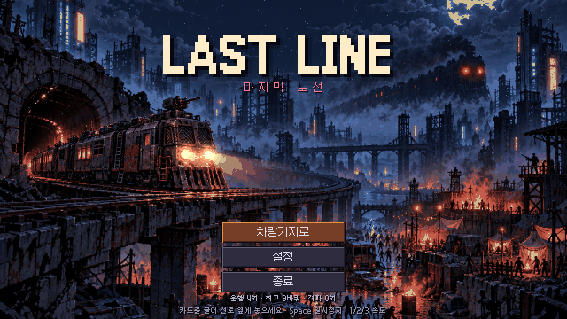
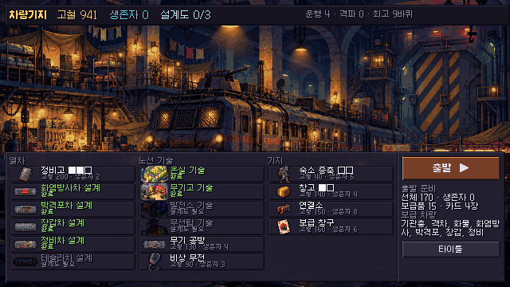
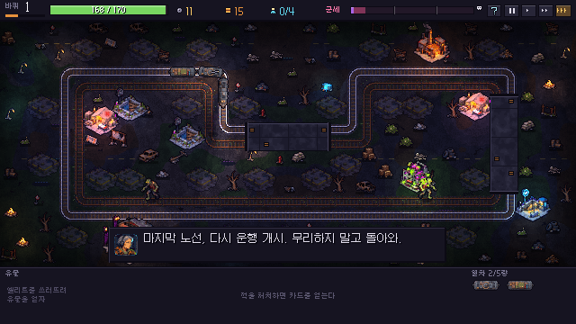
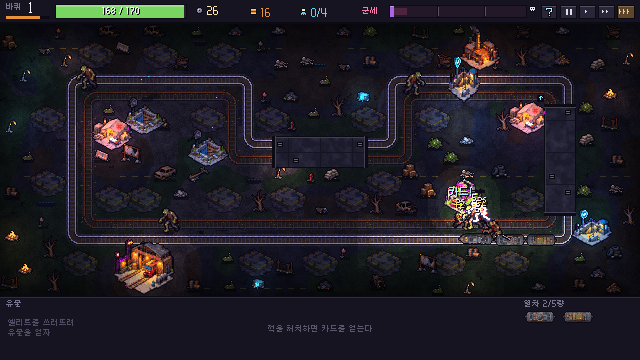

# LAST LINE — 마지막 노선

종말 이후의 도시, 마지막으로 달리는 지하철. 열차는 스스로 노선을 돌며 싸우고, 플레이어는 카드로 노선 주변 세계를 바꾼다. 더 벌려면 세계를 더 위험하게 만들어야 한다.

## 스크린샷

| 타이틀 | 차량기지 |
| --- | --- |
|  |  |

| 운행 초반 | 운행 진행 |
| --- | --- |
|  |  |

## 실행

- 빌드: `build/LastLine.exe` (Windows x64, 단일 실행 파일)
- 다운로드: [GitHub Releases](https://github.com/Legerdo/LAST-LINE/releases/latest)에서 Windows x64 ZIP을 받는다.
- 소스: Godot **4.7.2** (GL Compatibility)로 이 폴더를 열고 실행. 처음 여는 경우 에셋 임포트가 끝난 뒤 실행한다.
- 다시 빌드: `godot --headless --path . --export-release "Windows Desktop" build/LastLine.exe`

## 조작

| 입력 | 동작 |
|---|---|
| 카드 끌어 놓기 | 시설 카드 → 선로 옆 빈 부지 / 차량·개조 카드 → 열차 / 소각 → 시설 |
| 우클릭 (카드) | 버리기 (고철 +2) |
| 마우스 올리기 | 시설·적·차량·HUD 설명, 끄는 중에는 인접 효과 미리보기 |
| Space / 1·2·3 | 일시정지 / 속도 |
| H · F1 · 상단 `?` | 도움말 (조작·시설·진화·위험·군세·귀환, ←→ 페이지) |
| 차량기지: 1·2·3, Enter, R | 보급 선택, 계속 운행, 귀환 |
| Esc | 메뉴 (볼륨·화면 흔들림·전체 화면) |
| 튜토리얼 중 Enter · Space | 다음 |

## 튜토리얼

- **첫 운행**: 노선을 멈춘 채 관제실이 스포트라이트로 하나씩 짚어 준다(열차 → 선체 → 감염구역 → 손패 → 역 놓기 → 역 옆에 시장 놓기 → 진화 표시 → 소음·군세 → 조작). 카드 놓기 단계는 손가락 애니메이션이 끌어 놓는 법을 보여 주고, 빛나는 부지에만 놓을 수 있다.
- **첫 차량기지 정차**: 보급 고르기, 상점, 귀환 규칙, 계속/귀환 버튼을 차례로 안내한다. 첫 귀환 후 기지 화면도 3단계로 안내한다.
- **상황 팁**: 시스템이 처음 중요해지는 순간 한 번씩 해당 대상을 짚는다(차량 카드, 손패 가득, 진화, 위험 시설 성장, 감염 확산, 약탈자, 엘리트, 유물, 보급 부족, 선체 위험, 군세 70, 검은 열차).
- 상자 아래 `튜토리얼 건너뛰기`로 전부 끌 수 있고, 타이틀 설정의 `튜토리얼 다시 보기`로 처음부터 다시 볼 수 있다.

## 핵심 시스템

- **노선과 자동 전투**: 열차가 루프를 돈다. 무장 차량(기관총·화염·박격포·테슬라)이 자동 사격하고, 기관차는 선로 위 적을 들이받는다. 무거운 적과 바리케이드는 열차를 멈춘다.
- **시설 카드**: 역·시장·병원·공장·검문소·피난처 같은 민간 시설과 감염구역·약탈자 거점·폐역 같은 위험 시설. 위험 시설은 적을 뿜어내지만 처치 보상(고철·카드)이 크다.
- **인접 효과와 진화**: 역+시장 → 환승역, 병원+역 → 의료 거점, 약탈자+시장 → 암시장, 검문소+약탈자 → 용병 초소. 방치하면 감염구역 → 둥지, 폐역 → 망령역, 약탈자 → 요새로 커지고 엘리트를 낳는다. 감염은 보호받지 못한 민간 시설로 번진다.
- **군세 게이지**: 시설이 늘수록 매 바퀴 차오르고, 100이 되면 차량기지에서 **검은 열차**(보스)와의 결전을 선택하게 된다. 보스는 옆 폐선로를 달리며 포격·경적 충격파·번식 공격을 한다.
- **차량기지 결정**: 바퀴마다 보급 1개를 고르고, 상점을 이용하고, 계속 달릴지 귀환할지 정한다. 귀환하면 가진 것을 지키고(오래 달릴수록 운행 보너스), 파괴되면 고철 일부만 남고 생존자는 잃는다.
- **메타 진행**: 가져온 고철과 생존자로 기지를 넓혀 차량·카드·시작 자원을 해금한다. 일부는 엘리트가 떨어뜨린 설계도를 가지고 귀환해야 열린다. 보스를 이기면 위협 등급이 올라 다음 운행이 더 어렵고 보상이 커진다.

## 사용 도구와 에셋 워크플로

- **엔진**: Godot 4.7.2. 시뮬레이션(`src/core/sim.gd`)은 노드 없이 동작해 게임과 밸런스 하니스가 같은 코드를 쓴다.
- **이미지 (Codex CLI image_gen)**: 프롬프트는 `art_src/prompts/`, 실행은 `tools/gen_image.ps1 -Name <sheet>`. 마젠타 배경 스프라이트 시트로 받아 `tools/process_art.py`가 키잉, 공용 팔레트(Lab k-means) 양자화, 목표 해상도 다운샘플, 1px 외곽선, 발광 픽셀 분리(glow 맵), 적 걷기·공격 프레임을 만든다.
- **코드 기반 픽셀 아트**: 선로·터널·UI 프레임·아이콘(`tools/gen_tiles.py`), 지면과 소품 배치(`tools/gen_ground.py`, 노선 좌표는 `sim/export_map.gd`에서 내보냄).
- **조명**: 광원 스프라이트를 저해상도 라이트맵에 그리고, 화면 텍스처에 곱하는 셰이더(`src/game/light_overlay.gdshader`). 발광 픽셀과 열차는 조명 위에 그려 항상 또렷하다.
- **사운드**: 효과음 전부 numpy/scipy 합성(`tools/gen_sfx.py`), 노선 BGM은 동기화된 3개 스템(기본/긴장/전투)을 절차 생성(`tools/gen_music.py`)해 상황에 따라 섞는다. 타이틀·기지·보스·엔딩 곡은 로컬 HOT-Step YuE2로 생성(`art_src/music/`) 후 `tools/master_music.py`로 마스터링.
- **음성 (Fish Audio TTS)**: 역 안내·비상 방송·관제 무전 9줄(`tools/gen_voice.py`), ffmpeg로 PA/무전 필터 적용. 음성 없이도 진행에 지장 없다.
- **폰트**: Galmuri (SIL OFL 1.1, `assets/fonts/Galmuri-OFL.txt`).

## 밸런스 하니스

```powershell
powershell -File tools/sim.ps1 -Runs 40 -Meta none -Tag test   # 9개 성향 AI x 40판, 요약 출력
python tools/analyze.py --cards "sim/out/test-*.jsonl"          # 카드별 영향 (지배 카드/함정 카드 탐지)
```

성향: safe, aggressive, economy, greedy, random, turtle, farmer(킬존 악용 시도), stall(저소음 장기전), sprint(1~2바퀴 반복 귀환). 수정 이력과 근거는 `tools/retune_v*.py`, `tools/patch_sim_v*.py` 상단 주석에 있다(이미 적용된 기록용이라 다시 실행하지 않는다). `sim/out/`에 수정 전(v5)과 최종(v8) 결과가 남아 있다.

진행 불가 회귀 테스트: `godot --headless --path . --script res://sim/runner.gd -- --test=1`

QA 캡처: `godot --path . -- --screen=run --autoplay=greedy --speed=2 --shots=4,20` (스크린샷은 `art_src/shots/`).

튜토리얼 QA (프로필 `%APPDATA%\Godot\app_userdata\LAST LINE\profile.json`을 지운 상태에서):

- `godot --path . -- --screen=run --probe=tutorial`: 첫 운행 안내를 실제 입력으로 끝까지 진행하며 단계별 스크린샷
- `godot --path . -- --screen=run --probe=tips`: 상황 팁 전부와 도움말 페이지 스크린샷
- `godot --path . -- --screen=hub --probe=hubwalk`: 기지 안내 스크린샷
- `godot --headless --path . -- --screen=run --autoplay --probe=soak`: AI가 튜토리얼을 켠 채 플레이하며 발동한 팁 목록 출력
- `python tools/measure_text.py`: 안내 문장이 상자 폭을 넘지 않는지 검사(한국어는 자동 줄바꿈이 단어 중간을 끊으므로 줄바꿈은 직접 넣는다)
